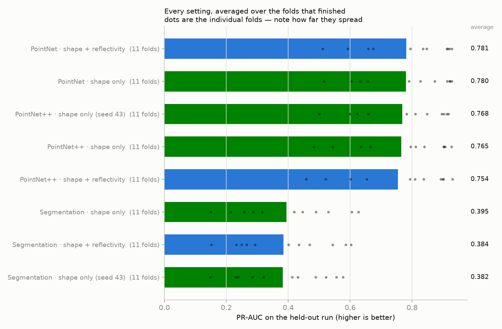
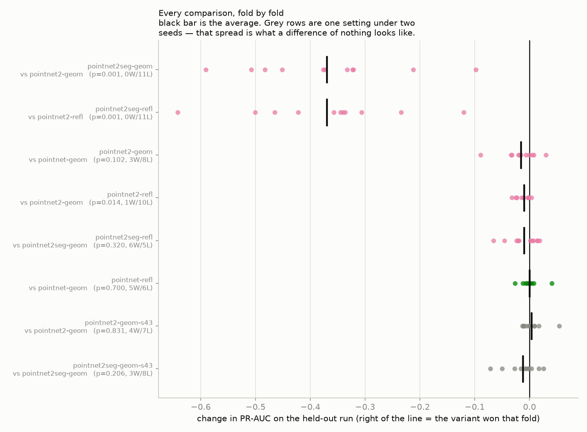
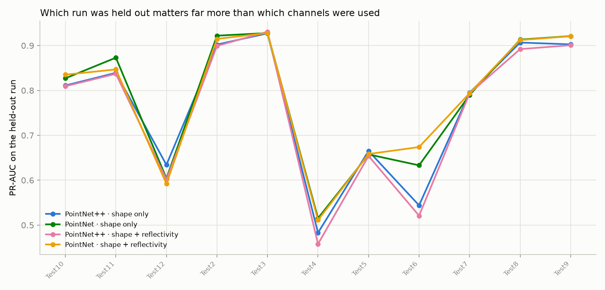

# Full sensor sweeps, and per-point segmentation

Trained on frames built from whole 20 Hz sensor rotations (~1250 points in the crop box) instead of single ~4 ms sensor batches (~110 points). Adds the whole-frame segmenter, which the batch-sized frames were too sparse to train at all.

Leave-one-run-out over 11 recordings: every setting is trained on all but one run and scored on the run it never saw. PR-AUC is the headline number — it is the one that stays honest when rocks are a small share of the samples.

**A difference of nothing looks like 0.0168 PR-AUC on this data.** That is the average fold-level gap between two runs of the *same* setting with only the random seed changed. Any effect smaller than that is noise, whatever the average says.

## Every setting

| setting | folds | PR-AUC | ROC-AUC | F1 | what it is |
|---|---|---|---|---|---|
| PointNet · shape + reflectivity | 11 | **0.781 ± 0.148** | 0.878 ± 0.115 | 0.682 ± 0.151 | Plain PointNet with reflectivity included. |
| PointNet · shape only | 11 | **0.780 ± 0.151** | 0.881 ± 0.109 | 0.676 ± 0.150 | Plain PointNet on single balls, shape only - the cheapest model, kept as the floor everything else has to beat. |
| PointNet++ · shape only (seed 43) | 11 | **0.768 ± 0.148** | 0.882 ± 0.097 | 0.669 ± 0.153 | Same setting as the shape-only PointNet++ arm, different random seed. Exists only to measure how far two identical settings land apart, so a difference between two real arms can be called real or not. |
| PointNet++ · shape only | 11 | **0.765 ± 0.158** | 0.879 ± 0.103 | 0.665 ± 0.155 | PointNet++ scoring one 0.5 m ball at a time, with the reflectivity channel removed. This is the arm to line up against the same-named arm of the reflectivity suite: same model, same settings, same folds - the only difference is that a frame here is a whole sensor rotation. |
| PointNet++ · shape + reflectivity | 11 | **0.754 ± 0.167** | 0.869 ± 0.120 | 0.660 ± 0.165 | PointNet++ on single balls with reflectivity added back, using the standard brightness jitter. |
| Segmentation · shape only | 11 | **0.395 ± 0.160** | 0.884 ± 0.074 | 0.410 ± 0.119 | PointNet++ labelling every point of a whole frame in one pass, shape only. The headline arm: it answers a rock question in one forward pass per frame instead of one per candidate ball. |
| Segmentation · shape + reflectivity | 11 | **0.384 ± 0.155** | 0.883 ± 0.083 | 0.406 ± 0.111 | The whole-frame segmenter with reflectivity added back. Denser frames give the segmenter far more brightness context than a single ball has, so this is where reflectivity has its best chance of paying off. |
| Segmentation · shape only (seed 43) | 11 | **0.382 ± 0.147** | 0.882 ± 0.075 | 0.410 ± 0.108 | Seed repeat of the shape-only segmentation arm - the noise floor for the segmenter. |

## Head to head, paired fold by fold

Each row trains two settings on the exact same folds and compares them one fold at a time. `W/L` counts folds won and lost. The p-value is a Wilcoxon signed-rank test: below 0.05 means the pattern of wins is unlikely to be chance.

| comparison | folds | change in PR-AUC | W/L | p | verdict |
|---|---|---|---|---|---|
| Shape only: does whole-frame segmentation beat the sliding-window classifier? | 11 | -0.3700 ± 0.1386 | 0/11 | 0.001 | hurts (-0.3700, p=0.001, 22.1x the noise floor) |
| Shape + reflectivity: does whole-frame segmentation beat the classifier? | 11 | -0.3700 ± 0.1381 | 0/11 | 0.001 | hurts (-0.3700, p=0.001, 22.1x the noise floor) |
| Shape only: is PointNet++ better than plain PointNet? | 11 | -0.0158 ± 0.0307 | 3/8 | 0.102 | no measurable difference (-0.0158, p=0.10) |
| PointNet++: does adding reflectivity beat shape alone? | 11 | -0.0103 ± 0.0119 | 1/10 | 0.014 | consistently hurts, but by less than changing the random seed does (-0.0103 vs a 0.0168 noise floor) — real, not worth acting on |
| Segmentation: does adding reflectivity beat shape alone? | 11 | -0.0104 ± 0.0273 | 6/5 | 0.320 | no measurable difference (-0.0104, p=0.32) |
| PointNet: does adding reflectivity beat shape alone? | 11 | +0.0003 ± 0.0163 | 5/6 | 0.700 | no measurable difference (+0.0003, p=0.70) |
| Noise floor: the same PointNet++ setting, two different seeds. | 11 | +0.0035 ± 0.0195 | 4/7 | 0.831 | yardstick — the same setting twice, so this spread (+0.0035) is what no difference looks like |
| Noise floor: the same segmentation setting, two different seeds. | 11 | -0.0123 ± 0.0282 | 3/8 | 0.206 | yardstick — the same setting twice, so this spread (-0.0123) is what no difference looks like |

## Per-fold detail

| setting | Test10 | Test11 | Test12 | Test2 | Test3 | Test4 | Test5 | Test6 | Test7 | Test8 | Test9 |
|---|---|---|---|---|---|---|---|---|---|---|---|
| PointNet++ · shape only | 0.811 | 0.839 | 0.634 | 0.902 | 0.927 | 0.483 | 0.665 | 0.544 | 0.795 | 0.907 | 0.903 |
| Segmentation · shape only | 0.490 | 0.627 | 0.258 | 0.419 | 0.605 | 0.150 | 0.214 | 0.446 | 0.287 | 0.316 | 0.529 |
| PointNet · shape only | 0.827 | 0.873 | 0.604 | 0.922 | 0.928 | 0.515 | 0.657 | 0.633 | 0.790 | 0.913 | 0.921 |
| PointNet++ · shape + reflectivity | 0.809 | 0.837 | 0.602 | 0.899 | 0.931 | 0.458 | 0.654 | 0.521 | 0.794 | 0.892 | 0.901 |
| Segmentation · shape + reflectivity | 0.469 | 0.603 | 0.265 | 0.434 | 0.586 | 0.151 | 0.232 | 0.401 | 0.293 | 0.250 | 0.543 |
| PointNet · shape + reflectivity | 0.835 | 0.847 | 0.592 | 0.915 | 0.928 | 0.511 | 0.658 | 0.674 | 0.794 | 0.912 | 0.921 |
| PointNet++ · shape only (seed 43) | 0.811 | 0.848 | 0.623 | 0.902 | 0.917 | 0.500 | 0.659 | 0.598 | 0.783 | 0.896 | 0.912 |
| Segmentation · shape only (seed 43) | 0.488 | 0.556 | 0.284 | 0.413 | 0.577 | 0.148 | 0.231 | 0.431 | 0.238 | 0.320 | 0.522 |

