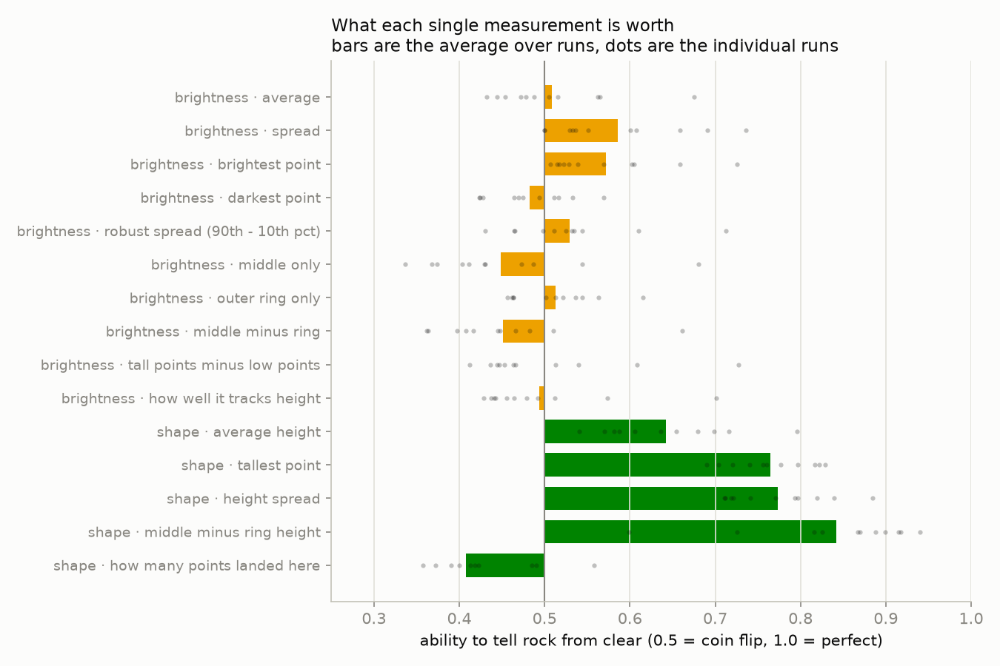
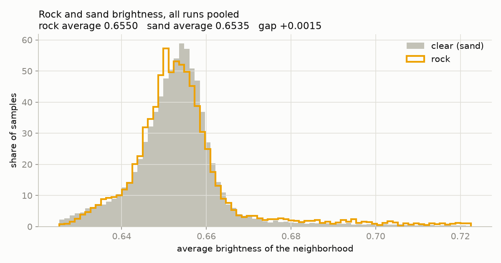
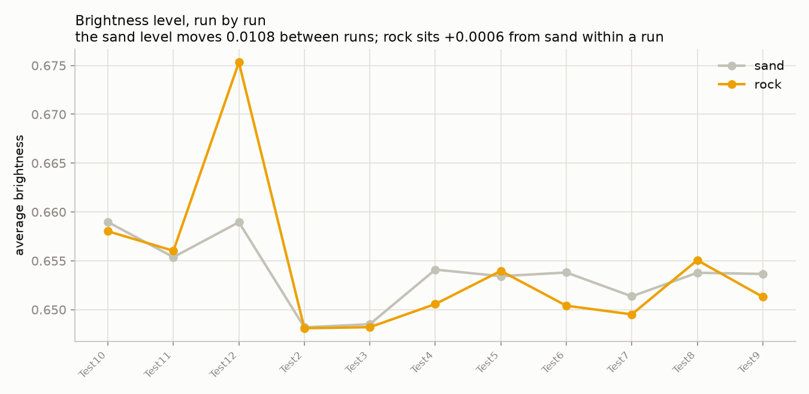
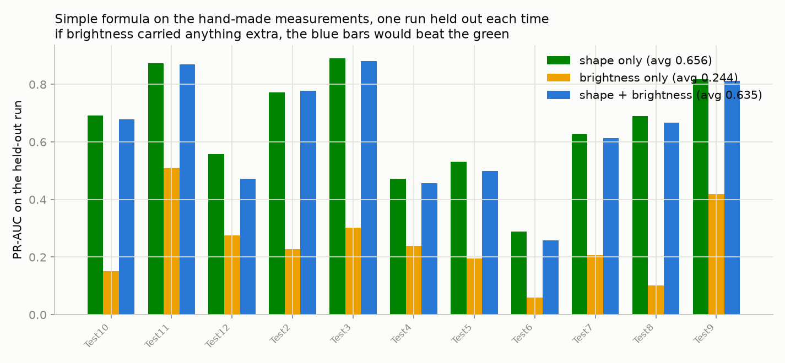

# What the reflectivity channel carries

Measured on `training/cache` — 11 runs, no training involved.

ROC-AUC below is the ability of one measurement, on its own, to tell a rock neighborhood from a clear one. 0.5 is a coin flip; 1.0 is perfect; below 0.5 means it separates them backwards.

## Each measurement on its own

| measurement | average | Test10 | Test11 | Test12 | Test2 | Test3 | Test4 | Test5 | Test6 | Test7 | Test8 | Test9 |
|---|---|---|---|---|---|---|---|---|---|---|---|---|
| brightness · average | **0.508** | 0.488 | 0.516 | 0.675 | 0.505 | 0.478 | 0.444 | 0.562 | 0.472 | 0.453 | 0.565 | 0.432 |
| brightness · spread | **0.586** | 0.659 | 0.690 | 0.736 | 0.500 | 0.532 | 0.536 | 0.601 | 0.500 | 0.551 | 0.529 | 0.608 |
| brightness · brightest point | **0.572** | 0.605 | 0.658 | 0.726 | 0.514 | 0.517 | 0.529 | 0.603 | 0.507 | 0.523 | 0.539 | 0.569 |
| brightness · darkest point | **0.483** | 0.425 | 0.423 | 0.470 | 0.516 | 0.511 | 0.475 | 0.569 | 0.494 | 0.465 | 0.533 | 0.428 |
| brightness · robust spread (90th - 10th pct) | **0.530** | 0.544 | 0.610 | 0.712 | 0.465 | 0.498 | 0.464 | 0.532 | 0.431 | 0.511 | 0.535 | 0.525 |
| brightness · middle only | **0.449** | 0.337 | 0.430 | 0.681 | 0.473 | 0.411 | 0.403 | 0.487 | 0.374 | 0.429 | 0.544 | 0.368 |
| brightness · outer ring only | **0.513** | 0.462 | 0.521 | 0.615 | 0.513 | 0.501 | 0.463 | 0.536 | 0.544 | 0.464 | 0.563 | 0.456 |
| brightness · middle minus ring | **0.451** | 0.364 | 0.408 | 0.662 | 0.483 | 0.417 | 0.448 | 0.466 | 0.362 | 0.445 | 0.510 | 0.398 |
| brightness · tall points minus low points | **0.501** | 0.447 | 0.463 | 0.727 | 0.513 | 0.540 | 0.444 | 0.436 | 0.466 | 0.453 | 0.608 | 0.412 |
| brightness · how well it tracks height | **0.493** | 0.456 | 0.441 | 0.701 | 0.492 | 0.512 | 0.443 | 0.437 | 0.464 | 0.479 | 0.574 | 0.429 |
| shape · average height | **0.642** | 0.582 | 0.716 | 0.636 | 0.654 | 0.698 | 0.679 | 0.587 | 0.796 | 0.540 | 0.570 | 0.606 |
| shape · tallest point | **0.765** | 0.761 | 0.817 | 0.741 | 0.822 | 0.829 | 0.690 | 0.720 | 0.797 | 0.704 | 0.777 | 0.756 |
| shape · height spread | **0.774** | 0.797 | 0.820 | 0.742 | 0.793 | 0.885 | 0.718 | 0.711 | 0.839 | 0.710 | 0.721 | 0.771 |
| shape · middle minus ring height | **0.842** | 0.899 | 0.867 | 0.599 | 0.915 | 0.917 | 0.825 | 0.816 | 0.726 | 0.888 | 0.940 | 0.870 |
| shape · how many points landed here | **0.407** | 0.177 | 0.400 | 0.485 | 0.490 | 0.422 | 0.418 | 0.358 | 0.390 | 0.413 | 0.558 | 0.372 |

## Absolute brightness level, run by run

| run | rock | sand | gap |
|---|---|---|---|
| VolleyBallTest10.reslam | 0.6580 | 0.6590 | -0.0009 |
| VolleyBallTest11.reslam | 0.6560 | 0.6554 | +0.0006 |
| VolleyBallTest12.reslam | 0.6753 | 0.6590 | +0.0164 |
| VolleyBallTest2.reslam | 0.6481 | 0.6482 | -0.0001 |
| VolleyBallTest3.reslam | 0.6482 | 0.6485 | -0.0003 |
| VolleyBallTest4.reslam | 0.6506 | 0.6541 | -0.0035 |
| VolleyBallTest5.reslam | 0.6540 | 0.6534 | +0.0005 |
| VolleyBallTest6.reslam | 0.6504 | 0.6538 | -0.0034 |
| VolleyBallTest7.reslam | 0.6495 | 0.6514 | -0.0018 |
| VolleyBallTest8.reslam | 0.6551 | 0.6538 | +0.0013 |
| VolleyBallTest9.reslam | 0.6513 | 0.6537 | -0.0023 |

The sand level moves **0.0108** between runs, while rock sits **+0.0006** from sand inside one run. When the second number is smaller than the first, an absolute brightness threshold cannot be carried from one run to the next.

## A simple formula on these measurements, one run held out at a time

| inputs | PR-AUC | ROC-AUC |
|---|---|---|
| shape only | 0.656 | 0.866 |
| brightness only | 0.244 | 0.570 |
| shape + brightness | 0.635 | 0.845 |

