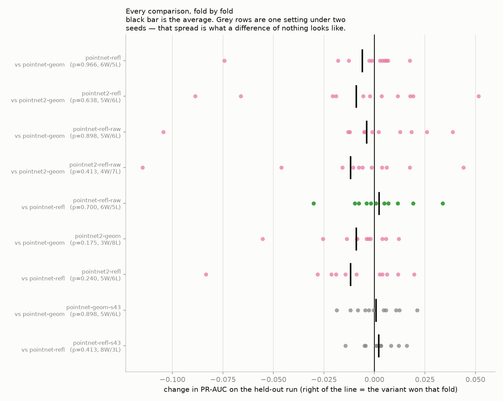
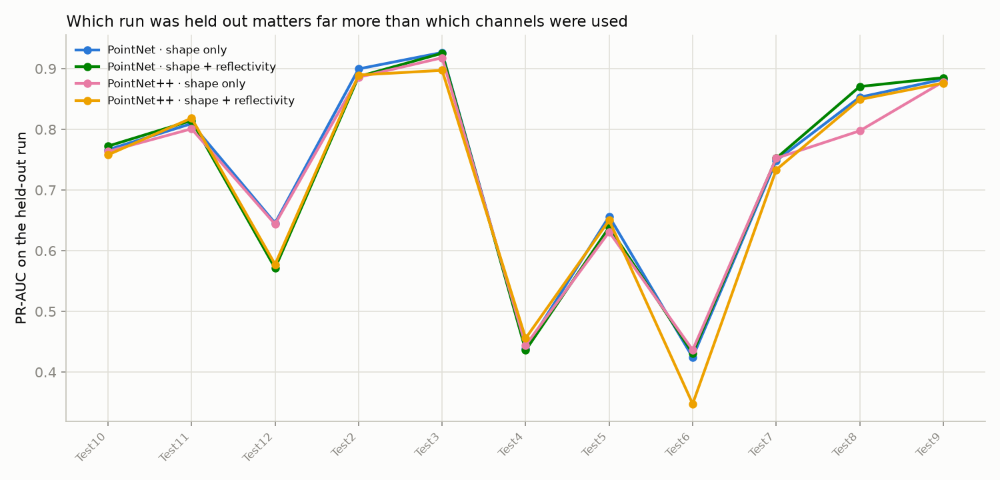

# Does reflectivity help?

PointNet and PointNet++, with and without the reflectivity channel, plus seed repeats that show how big a meaningless difference looks.

Leave-one-run-out over 11 recordings: every setting is trained on all but one run and scored on the run it never saw. PR-AUC is the headline number — it is the one that stays honest when rocks are a small share of the samples.

**A difference of nothing looks like 0.0078 PR-AUC on this data.** That is the average fold-level gap between two runs of the *same* setting with only the random seed changed. Any effect smaller than that is noise, whatever the average says.

## Every setting

| setting | folds | PR-AUC | ROC-AUC | F1 | what it is |
|---|---|---|---|---|---|
| PointNet · shape only (seed 43) | 11 | **0.733 ± 0.174** | 0.867 ± 0.104 | 0.613 ± 0.179 | Same setting as the shape-only arm, different random seed. Exists only to measure how far two identical settings land apart. |
| PointNet · shape only | 11 | **0.732 ± 0.175** | 0.870 ± 0.098 | 0.625 ± 0.162 | PointNet with the reflectivity channel removed entirely. The control: whatever this scores is what pure geometry is worth. |
| PointNet · shape only (seed 44) | 11 | **0.731 ± 0.174** | 0.868 ± 0.100 | 0.613 ± 0.173 | Second seed repeat of the shape-only arm. |
| PointNet · reflectivity unjittered | 11 | **0.728 ± 0.184** | 0.860 ± 0.136 | 0.634 ± 0.177 | PointNet with reflectivity included and the reflectivity augmentation switched off, so the model may use the raw absolute brightness. If reflectivity helps anywhere, it helps most here — and the gap between this and the jittered arm is the size of the cue the augmentation deliberately destroys. |
| PointNet · shape + reflectivity (seed 43) | 11 | **0.728 ± 0.181** | 0.863 ± 0.121 | 0.627 ± 0.179 | Seed repeat of the shape+reflectivity arm. |
| PointNet · shape + reflectivity (seed 44) | 11 | **0.726 ± 0.177** | 0.860 ± 0.123 | 0.624 ± 0.171 | Second seed repeat of the shape+reflectivity arm. |
| PointNet · shape + reflectivity | 11 | **0.726 ± 0.180** | 0.861 ± 0.120 | 0.621 ± 0.178 | PointNet with reflectivity included, using the standard augmentation (reflectivity randomly rescaled and shifted each sample). This is the setting the existing runs used. |
| PointNet++ · shape only | 11 | **0.723 ± 0.167** | 0.866 ± 0.095 | 0.612 ± 0.163 | PointNet++ with no reflectivity. The shape-only control for the hierarchical model. |
| PointNet++ · shape + reflectivity | 11 | **0.714 ± 0.186** | 0.855 ± 0.115 | 0.627 ± 0.167 | PointNet++ with reflectivity included and the standard augmentation. |
| PointNet++ · reflectivity unjittered | 11 | **0.711 ± 0.182** | 0.847 ± 0.138 | 0.615 ± 0.174 | PointNet++ with reflectivity included and its augmentation off. |
| PointNet · reflectivity only | 11 | **0.224 ± 0.124** | 0.546 ± 0.092 | 0.260 ± 0.117 | PointNet fed nothing but reflectivity — no coordinates at all. It cannot see shape, so its score is a direct read of how much the brightness numbers alone can separate rock from sand. |

## Head to head, paired fold by fold

Each row trains two settings on the exact same folds and compares them one fold at a time. `W/L` counts folds won and lost. The p-value is a Wilcoxon signed-rank test: below 0.05 means the pattern of wins is unlikely to be chance.

| comparison | folds | change in PR-AUC | W/L | p | verdict |
|---|---|---|---|---|---|
| PointNet: does adding reflectivity beat shape alone? | 11 | -0.0061 ± 0.0246 | 6/5 | 0.966 | no measurable difference (-0.0061, p=0.97) |
| PointNet++: does adding reflectivity beat shape alone? | 11 | -0.0090 ± 0.0396 | 5/6 | 0.638 | no measurable difference (-0.0090, p=0.64) |
| PointNet: does reflectivity help when its augmentation is switched off? | 11 | -0.0039 ± 0.0371 | 5/6 | 0.898 | no measurable difference (-0.0039, p=0.90) |
| PointNet++: does reflectivity help when its augmentation is switched off? | 11 | -0.0119 ± 0.0406 | 4/7 | 0.413 | no measurable difference (-0.0119, p=0.41) |
| PointNet: how much does the reflectivity augmentation cost? | 11 | +0.0022 ± 0.0166 | 6/5 | 0.700 | no measurable difference (+0.0022, p=0.70) |
| Shape only: is PointNet++ better than PointNet? | 11 | -0.0090 ± 0.0184 | 3/8 | 0.175 | no measurable difference (-0.0090, p=0.17) |
| Shape + reflectivity: is PointNet++ better than PointNet? | 11 | -0.0119 ± 0.0281 | 5/6 | 0.240 | no measurable difference (-0.0119, p=0.24) |
| Noise floor: the same shape-only setting, two different seeds. | 11 | +0.0007 ± 0.0116 | 5/6 | 0.898 | yardstick — the same setting twice, so this spread (+0.0007) is what no difference looks like |
| Noise floor: the same shape+reflectivity setting, two different seeds. | 11 | +0.0021 ± 0.0084 | 8/3 | 0.413 | yardstick — the same setting twice, so this spread (+0.0021) is what no difference looks like |

## Per-fold detail

| setting | Test10 | Test11 | Test12 | Test2 | Test3 | Test4 | Test5 | Test6 | Test7 | Test8 | Test9 |
|---|---|---|---|---|---|---|---|---|---|---|---|
| PointNet · shape only | 0.766 | 0.809 | 0.646 | 0.900 | 0.927 | 0.438 | 0.656 | 0.424 | 0.748 | 0.853 | 0.882 |
| PointNet · shape + reflectivity | 0.772 | 0.814 | 0.571 | 0.887 | 0.925 | 0.436 | 0.638 | 0.431 | 0.752 | 0.870 | 0.885 |
| PointNet++ · shape only | 0.764 | 0.801 | 0.644 | 0.886 | 0.918 | 0.444 | 0.631 | 0.436 | 0.752 | 0.798 | 0.878 |
| PointNet++ · shape + reflectivity | 0.758 | 0.818 | 0.578 | 0.889 | 0.897 | 0.456 | 0.650 | 0.348 | 0.733 | 0.849 | 0.876 |
| PointNet · reflectivity unjittered | 0.779 | 0.848 | 0.541 | 0.899 | 0.921 | 0.426 | 0.643 | 0.450 | 0.751 | 0.871 | 0.877 |
| PointNet++ · reflectivity unjittered | 0.762 | 0.845 | 0.529 | 0.870 | 0.907 | 0.448 | 0.637 | 0.390 | 0.745 | 0.815 | 0.872 |
| PointNet · reflectivity only | 0.115 | 0.483 | 0.278 | 0.218 | 0.286 | 0.211 | 0.183 | 0.048 | 0.187 | 0.098 | 0.358 |
| PointNet · shape only (seed 43) | 0.772 | 0.831 | 0.637 | 0.895 | 0.931 | 0.427 | 0.669 | 0.435 | 0.748 | 0.834 | 0.880 |
| PointNet · shape + reflectivity (seed 43) | 0.767 | 0.826 | 0.572 | 0.890 | 0.921 | 0.422 | 0.654 | 0.439 | 0.755 | 0.873 | 0.886 |
| PointNet · shape only (seed 44) | 0.769 | 0.814 | 0.636 | 0.897 | 0.924 | 0.410 | 0.668 | 0.456 | 0.738 | 0.856 | 0.877 |
| PointNet · shape + reflectivity (seed 44) | 0.771 | 0.825 | 0.565 | 0.891 | 0.920 | 0.450 | 0.651 | 0.433 | 0.737 | 0.862 | 0.884 |

