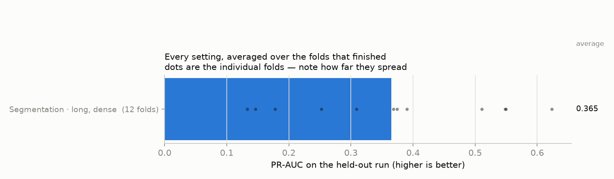
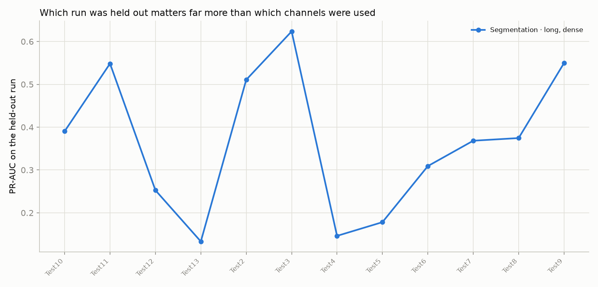

# Feeding the whole-frame segmenter properly

Every sensor rotation kept instead of every fourth (~4x the frames), 60 epochs instead of 30, and an arm that looks at 10 cm scales instead of 25 cm. The previous sweep found the segmenter starved of frames and stopped before it had finished learning; this one removes both limits. Twelve folds, not eleven - VolleyBallTest13 joins as a fold here.

Leave-one-run-out over 12 recordings: every setting is trained on all but one run and scored on the run it never saw. PR-AUC is the headline number — it is the one that stays honest when rocks are a small share of the samples.

## Every setting

**Normalized PR-AUC** is the same score with the fold's own rock share divided out: `(PR-AUC - rock share) / (1 - rock share)`. Guessing scores 0 and a perfect model scores 1, so recordings with very different numbers of rocks can be put on one line. Raw PR-AUC is kept beside it for continuity with the earlier sweeps. The two are never comparable *across* tasks — a segmenter graded per point and a classifier graded per candidate ball are still two different measurements after normalizing.

| setting | folds | PR-AUC | normalized | ROC-AUC | F1 | what it is |
|---|---|---|---|---|---|---|
| Segmentation · long, dense | 12 | **0.365 ± 0.168** | 0.358 ± 0.169 | 0.852 ± 0.100 | 0.393 ± 0.137 | The whole-frame segmenter on four times as many frames, trained for 60 epochs instead of 30. The headline arm: the previous sweep's segmentation folds all ran out of epochs before they stopped improving, and the segmenter was learning from ~2,165 frames per fold where the sliding-window classifier had 94,519 samples. Both of those are fixed here, and they pull the same way. |

## Head to head, paired fold by fold

Each row trains two settings on the exact same folds and compares them one fold at a time. `W/L` counts folds won and lost. The p-value is a Wilcoxon signed-rank test: below 0.05 means the pattern of wins is unlikely to be chance.

| comparison | folds | change in PR-AUC | same, normalized | W/L | p | verdict |
|---|---|---|---|---|---|---|
| Segmentation: does looking at finer scales beat the stock level geometry? | 0 | — | — | — | — | not run yet |
| Does whole-frame segmentation beat the sliding-window classifier? | 0 | — | — | — | — | not run yet |
| Does the finer-level segmenter beat the sliding-window classifier? | 0 | — | — | — | — | not run yet |
| Noise floor: the same long segmentation setting, two different seeds. | 0 | — | — | — | — | not run yet |

## Per-fold detail, raw PR-AUC

This is the table the two earlier sweeps report, and on its own it is misleading: a recording with more rocks starts higher for free.

| setting | Test10 | Test11 | Test12 | Test13 | Test2 | Test3 | Test4 | Test5 | Test6 | Test7 | Test8 | Test9 |
|---|---|---|---|---|---|---|---|---|---|---|---|---|
| Segmentation · long, dense | 0.390 | 0.548 | 0.253 | 0.133 | 0.511 | 0.624 | 0.146 | 0.178 | 0.309 | 0.368 | 0.375 | 0.550 |

## Per-fold detail, with rock share divided out

The same folds, scored so that guessing is 0 and perfect is 1. This is the table to read when asking *which recording is hard*.

| setting | Test10 | Test11 | Test12 | Test13 | Test2 | Test3 | Test4 | Test5 | Test6 | Test7 | Test8 | Test9 |
|---|---|---|---|---|---|---|---|---|---|---|---|---|
| Segmentation · long, dense | 0.386 | 0.540 | 0.239 | 0.121 | 0.505 | 0.619 | 0.135 | 0.172 | 0.305 | 0.363 | 0.370 | 0.542 |

How much of each recording is rock, in the units each model is graded in — this is exactly the amount the second table removes:

| graded per | Test10 | Test11 | Test12 | Test13 | Test2 | Test3 | Test4 | Test5 | Test6 | Test7 | Test8 | Test9 |
|---|---|---|---|---|---|---|---|---|---|---|---|---|
| pointnet2_seg | 0.8% | 1.9% | 1.8% | 1.4% | 1.1% | 1.2% | 1.3% | 0.7% | 0.5% | 0.9% | 0.7% | 1.6% |

