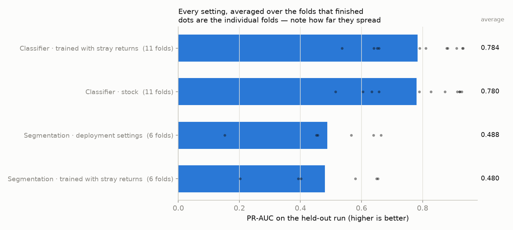
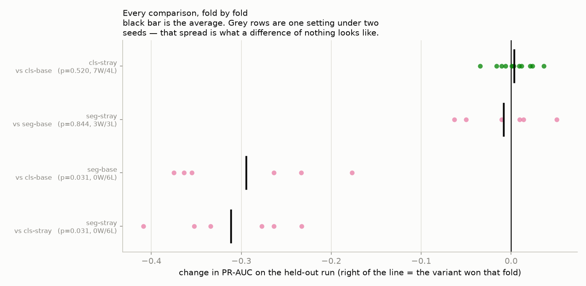
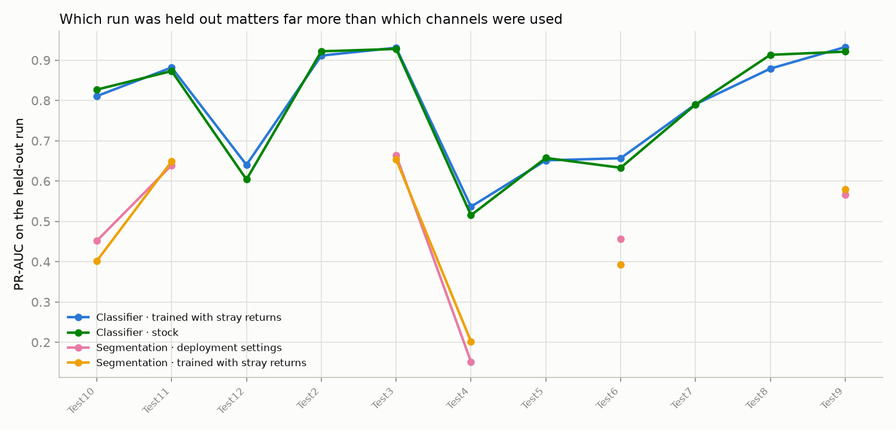

# Training against stray returns

Every recording this project owns was made over flat ground the sensor struck steeply, so almost every return in them landed on a real surface and nothing has ever taught either model that a return can simply be wrong. A competition arena 7 m across with the sensor 0.57 m up is seen at a grazing angle almost everywhere, and is full of them. This sweep asks what it costs to train against clutter that is not in the data: both model families, each with and without 5% of every training sample turned into returns that sit on no surface. The segmenter arms also carry every other setting the rig is meant to deploy with, so the control is the real deployment candidate rather than a historical baseline.

Leave-one-run-out over 11 recordings: every setting is trained on all but one run and scored on the run it never saw. PR-AUC is the headline number — it is the one that stays honest when rocks are a small share of the samples.

## Every setting

**Normalized PR-AUC** is the same score with the fold's own rock share divided out: `(PR-AUC - rock share) / (1 - rock share)`. Guessing scores 0 and a perfect model scores 1, so recordings with very different numbers of rocks can be put on one line. Raw PR-AUC is kept beside it for continuity with the earlier sweeps. The two are never comparable *across* tasks — a segmenter graded per point and a classifier graded per candidate ball are still two different measurements after normalizing.

| setting | folds | PR-AUC | normalized | ROC-AUC | F1 | what it is |
|---|---|---|---|---|---|---|
| Classifier · trained with stray returns | 11 | **0.784 ± 0.140** | 0.736 ± 0.172 | 0.895 ± 0.092 | 0.673 ± 0.154 | The same classifier with one thing added: 5% of every training neighborhood becomes a return that sits on no surface, slid along the line of sight it arrived on. Single-variable against cls-base. |
| Classifier · stock | 11 | **0.780 ± 0.151** | 0.730 ± 0.188 | 0.881 ± 0.109 | 0.676 ± 0.150 | Plain PointNet on 0.5 m candidate balls, shape only. The control for the classifier pair, and the best-scoring classifier setting two sweeps have found - PointNet++ measured no better and costs three times as much, and reflectivity measured no better and is the channel least likely to survive a change of arena. |
| Segmentation · deployment settings | 6 | **0.488 ± 0.187** | 0.482 ± 0.189 | 0.897 ± 0.080 | 0.489 ± 0.142 | The whole-frame segmenter as the rig is meant to run it: 80 epochs, the finer level geometry, heights measured from the frame's own floor, a random ground tilt, and frame-centred coordinates. The control for the segmenter pair. |
| Segmentation · trained with stray returns | 6 | **0.480 ± 0.179** | 0.474 ± 0.180 | 0.906 ± 0.054 | 0.476 ± 0.142 | The deployment segmenter with 5% of every training frame turned into stray returns. Real bad returns are mixed pixels and grazing-angle range errors, so they slide along their own beam and hang in mid-air rather than scattering evenly - which is why the competition cloud looks like fog while these eleven recordings do not. Nothing in the training data has ever held one, so a model has no reason not to read a clump of them as an object. Single-variable against seg-base: if it costs nothing on clean volleyball data, it is free insurance for a bin that is not clean. |

## Head to head, paired fold by fold

Each row trains two settings on the exact same folds and compares them one fold at a time. `W/L` counts folds won and lost. The p-value is a Wilcoxon signed-rank test: below 0.05 means the pattern of wins is unlikely to be chance.

| comparison | folds | change in PR-AUC | same, normalized | W/L | p | verdict |
|---|---|---|---|---|---|---|
| Classifier: does training against stray returns cost anything on clean data? | 11 | +0.0034 ± 0.0200 | +0.0055 | 7/4 | 0.520 | no measurable difference (+0.0034, p=0.52) |
| Segmentation: does training against stray returns cost anything on clean data? | 6 | -0.0083 ± 0.0424 | -0.0083 | 3/3 | 0.844 | no measurable difference (-0.0083, p=0.84) |
| Does the deployment segmenter beat the sliding-window classifier? | 6 | -0.2947 ± 0.0817 | -0.2547 | 0/6 | 0.031 | hurts (-0.2947, p=0.031) |
| The same question with both models trained against stray returns. | 6 | -0.3116 ± 0.0653 | -0.2742 | 0/6 | 0.031 | hurts (-0.3116, p=0.031) |

## Per-fold detail, raw PR-AUC

This is the table the two earlier sweeps report, and on its own it is misleading: a recording with more rocks starts higher for free.

| setting | Test10 | Test11 | Test12 | Test2 | Test3 | Test4 | Test5 | Test6 | Test7 | Test8 | Test9 |
|---|---|---|---|---|---|---|---|---|---|---|---|
| Classifier · stock | 0.827 | 0.873 | 0.604 | 0.922 | 0.928 | 0.515 | 0.657 | 0.633 | 0.790 | 0.913 | 0.921 |
| Classifier · trained with stray returns | 0.811 | 0.882 | 0.640 | 0.911 | 0.931 | 0.536 | 0.651 | 0.657 | 0.790 | 0.879 | 0.933 |
| Segmentation · deployment settings | 0.452 | 0.640 | – | – | 0.664 | 0.152 | – | 0.456 | – | – | 0.566 |
| Segmentation · trained with stray returns | 0.402 | 0.649 | – | – | 0.654 | 0.202 | – | 0.393 | – | – | 0.580 |

## Per-fold detail, with rock share divided out

The same folds, scored so that guessing is 0 and perfect is 1. This is the table to read when asking *which recording is hard*.

| setting | Test10 | Test11 | Test12 | Test2 | Test3 | Test4 | Test5 | Test6 | Test7 | Test8 | Test9 |
|---|---|---|---|---|---|---|---|---|---|---|---|
| Classifier · stock | 0.812 | 0.814 | 0.444 | 0.902 | 0.905 | 0.395 | 0.611 | 0.608 | 0.749 | 0.903 | 0.888 |
| Classifier · trained with stray returns | 0.794 | 0.827 | 0.495 | 0.889 | 0.908 | 0.422 | 0.604 | 0.633 | 0.750 | 0.864 | 0.904 |
| Segmentation · deployment settings | 0.448 | 0.632 | – | – | 0.660 | 0.141 | – | 0.453 | – | – | 0.559 |
| Segmentation · trained with stray returns | 0.398 | 0.642 | – | – | 0.649 | 0.192 | – | 0.390 | – | – | 0.573 |

How much of each recording is rock, in the units each model is graded in — this is exactly the amount the second table removes:

| graded per | Test10 | Test11 | Test12 | Test2 | Test3 | Test4 | Test5 | Test6 | Test7 | Test8 | Test9 |
|---|---|---|---|---|---|---|---|---|---|---|---|
| pointnet | 8.2% | 31.6% | 28.8% | 20.1% | 24.4% | 19.8% | 12.0% | 6.3% | 16.2% | 10.8% | 29.9% |
| pointnet2_seg | 0.7% | 1.9% | – | – | 1.2% | 1.3% | – | 0.5% | – | – | 1.6% |

## `seg-capped` — capping the loss weight does not rescue the segmenter

*Added 4 September 2026.*

The grid-model sweep found that how much a rock outweighs bare ground in the
loss decides whether that family works away from home: left at the raw ~93,
10 of 18 checkpoints went blank on the competition arena; capped at 10, none
of 12 did. The segmenter carries the same weight (~93–102 measured) and shows
the same symptom, so the obvious question was whether the same fix applies.

**It does not.** `seg-capped` is `seg-base` with one change, the weight capped
at 10. Three folds, scored on the same 100 arena frames:

| fold | rocks at own threshold | rocks at equal cost | confidence gap | grid score |
|---|---|---|---|---|
| VolleyBallTest10 | 37 → **57** | 103 → 106 | +0.892 → +0.266 | 0.516 → **0.554** |
| VolleyBallTest6 | 16 → 16 | 109 → **47** | +0.433 → **+0.004** | 0.395 → 0.334 |
| VolleyBallTest9 | 15 → **56** | 102 → 103 | +0.430 → +0.171 | 0.389 → **0.463** |

Mean change: grid score +0.017 (ahead on 2 of 3), confidence gap **−0.438**
(behind on 3 of 3), rocks at equal cost **−19** (VB6 alone loses 62).
**Blank runs went from 0 of 3 to 2 of 3.**

So capping made the segmenter *more* prone to the failure it was meant to
cure, while the identical change cured it for the grid model. Why the two
families split on the same knob is not understood, and three folds is thin —
but the direction is wrong on every fold for the metric that matters most, so
this is not a promising thread.

**One thing worth carrying forward.** On all three folds `seg-base` finds
**102–109 of 112** rocks once every model is given the same budget of wrong
cells per frame — essentially matching `cls-stray`'s 109. Its collapse to
15–37 rocks happens entirely at its *own* chosen threshold. That is consistent
with the headline finding here and sharpens it: the segmenter is not blind,
it picks a threshold on the volleyball validation split that means nothing on
the arena. Whether a better-travelling threshold rule would close the gap has
not been tested and is cheaper than any retraining.

Folds: `training/experiments/stray/seg-capped/`. Re-score with
`../bev/bev_lance.py`.
