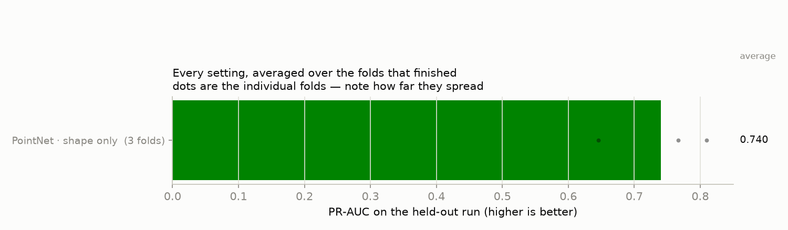

# Does reflectivity help?

PointNet and PointNet++, with and without the reflectivity channel, plus seed repeats that show how big a meaningless difference looks.

Leave-one-run-out over 3 recordings: every setting is trained on all but one run and scored on the run it never saw. PR-AUC is the headline number — it is the one that stays honest when rocks are a small share of the samples.

## Every setting

| setting | folds | PR-AUC | ROC-AUC | F1 | what it is |
|---|---|---|---|---|---|
| PointNet · shape only | 3 | **0.740 ± 0.085** | 0.820 ± 0.108 | 0.582 ± 0.120 | PointNet with the reflectivity channel removed entirely. The control: whatever this scores is what pure geometry is worth. |

## Head to head, paired fold by fold

Each row trains two settings on the exact same folds and compares them one fold at a time. `W/L` counts folds won and lost. The p-value is a Wilcoxon signed-rank test: below 0.05 means the pattern of wins is unlikely to be chance.

| comparison | folds | change in PR-AUC | W/L | p | verdict |
|---|---|---|---|---|---|
| PointNet: does adding reflectivity beat shape alone? | 0 | — | — | — | not run yet |
| PointNet++: does adding reflectivity beat shape alone? | 0 | — | — | — | not run yet |
| PointNet: does reflectivity help when its augmentation is switched off? | 0 | — | — | — | not run yet |
| PointNet++: does reflectivity help when its augmentation is switched off? | 0 | — | — | — | not run yet |
| PointNet: how much does the reflectivity augmentation cost? | 0 | — | — | — | not run yet |
| Shape only: is PointNet++ better than PointNet? | 0 | — | — | — | not run yet |
| Shape + reflectivity: is PointNet++ better than PointNet? | 0 | — | — | — | not run yet |
| Noise floor: the same shape-only setting, two different seeds. | 0 | — | — | — | not run yet |
| Noise floor: the same shape+reflectivity setting, two different seeds. | 0 | — | — | — | not run yet |

## Per-fold detail

| setting | Test10 | Test11 | Test12 |
|---|---|---|---|
| PointNet · shape only | 0.766 | 0.809 | 0.646 |

